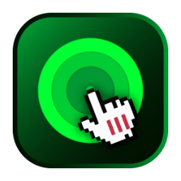

<div align="center">



# Robot-clic

**A light, simple and beautiful autoclicker for macOS, with a neutral glassmorphism UI.**

[](https://github.com/hollyenah/robot-clic/releases/latest)
[](https://github.com/hollyenah/robot-clic/releases)
[](#requirements)
[](#build-from-source)
[](https://linktr.ee/Hollyenah)
[](LICENSE)

</div>

---

## Features

- **Interval** in milliseconds
- **Click count**, or infinite mode (∞)
- **Start delay** before the first click, with a live countdown
- **Custom shortcuts** to start and stop, from any app
- **Fixed position**: pick coordinates by clicking anywhere on screen; the cursor is teleported there when the run starts
- **Glassmorphism UI**: neutral, transparent, no gradients
- Universal binary (Intel + Apple Silicon), single file, no dependencies

## Requirements

| Mac | Minimum macOS |
| --- | --- |
| Intel | 10.15 Catalina |
| Apple Silicon | 11 Big Sur |

## Installation

### Download

1. Grab the latest `Robot-clic.app` (zipped) from the [Releases page](https://github.com/hollyenah/robot-clic/releases/latest).
2. Move it to your `Applications` folder.
3. The app is not notarized, so on first launch: **right-click > Open > Open**.

### Build from source

You need the Xcode Command Line Tools (`xcode-select --install`).

```bash
git clone https://github.com/hollyenah/robot-clic.git
cd robot-clic
bash build.sh
```

The script compiles both architectures, builds the icon from `icon.png`, signs the app ad hoc and opens it. Compiling takes roughly 30 to 60 seconds.

## Permissions

Robot-clic simulates mouse clicks and listens to global shortcuts, so macOS requires your approval:

1. Open **System Settings > Privacy & Security > Accessibility**
2. Enable **Robot-clic**
3. If shortcuts still do not react, also enable it under **Input Monitoring**

If you rebuild the app, macOS may ask you to remove and re-add it in that list.

## Usage

| Setting | Description |
| --- | --- |
| Interval | Time between two clicks, in ms (minimum 1) |
| Click count | Number of clicks, or the ∞ switch for no limit |
| Start delay | Seconds to wait before the first click |
| Fixed position | Click at set X / Y coordinates instead of the current cursor position |
| Pick by clicking | Click anywhere on screen to save the coordinates (`Esc` to cancel) |
| Shortcuts | Click a shortcut button, then press the new key combination |

Default shortcuts: **F6** to start, **F7** to stop. Coordinates are in screen points, origin at the top-left of the main display.

## Project structure

```text
robot-clic/
├── main.swift   # the whole app (SwiftUI + AppKit)
├── build.sh     # builds the universal .app bundle
├── icon.png     # 1024x1024 source icon
└── README.md
```

## Troubleshooting

| Problem | Fix |
| --- | --- |
| "Application may be damaged or incomplete" | The build did not finish. Check the terminal for `error:` lines, then run `rm -rf Robot-clic.app && bash build.sh` |
| Clicks do nothing | Enable the app in Accessibility (see [Permissions](#permissions)) |
| Shortcuts do not react | Also enable Input Monitoring, and avoid keys already used by macOS |
| Old icon still showing | Run `touch Robot-clic.app` |

## Support the project

If Robot-clic saves you time, you can support its development:

[](https://YOUR-DONATION-LINK-HERE)

## License

Released under the [GNU General Public License v3.0](LICENSE).

---

<div align="center">

[github.com/hollyenah/robot-clic](https://github.com/hollyenah/robot-clic) · By Hollyenah

</div>
